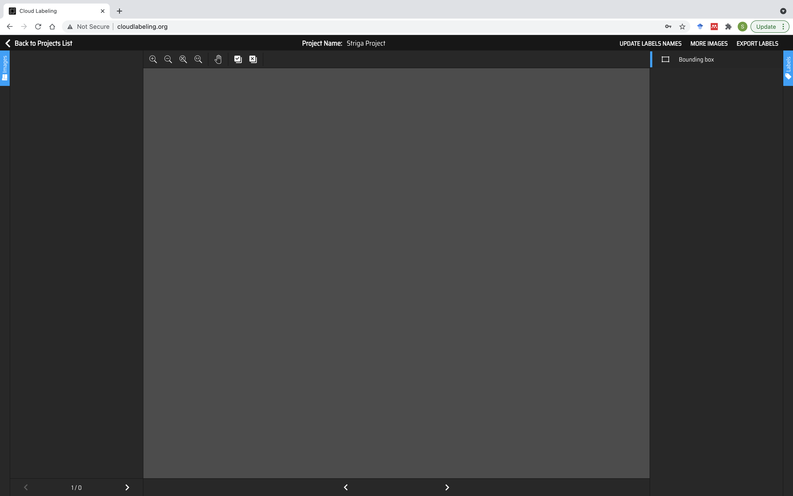

:github_url: https://github.com/SilvioGiancola/CloudLabeling

.. role:: raw-html(raw)
   :format: html
.. default-role:: raw-html

Create a Project
================

To create a project, type a name is the box "New Project Name" and click on "Add".

.. image:: ./image/3_CreateProject.png
  :width: 600
  :alt: Alternative text

Once your project is created, you can "Open" it.

