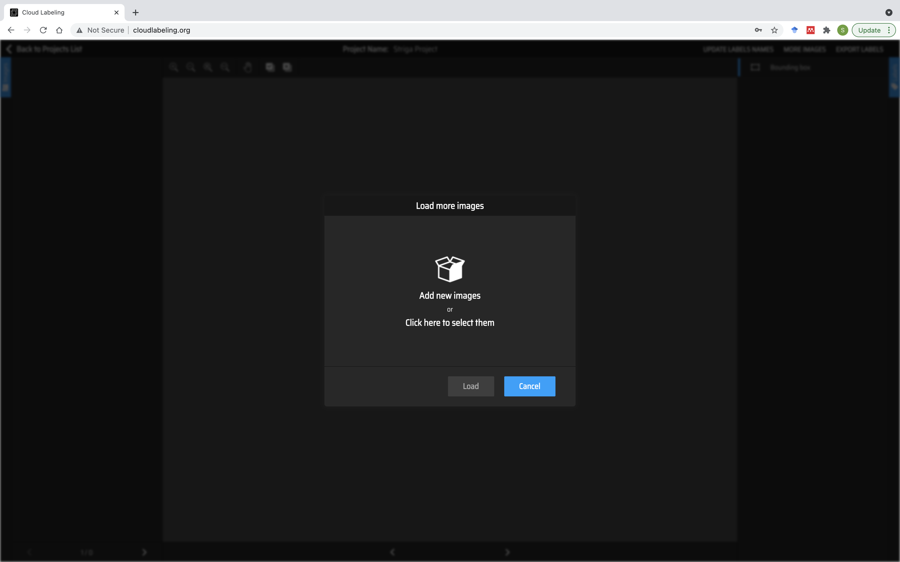
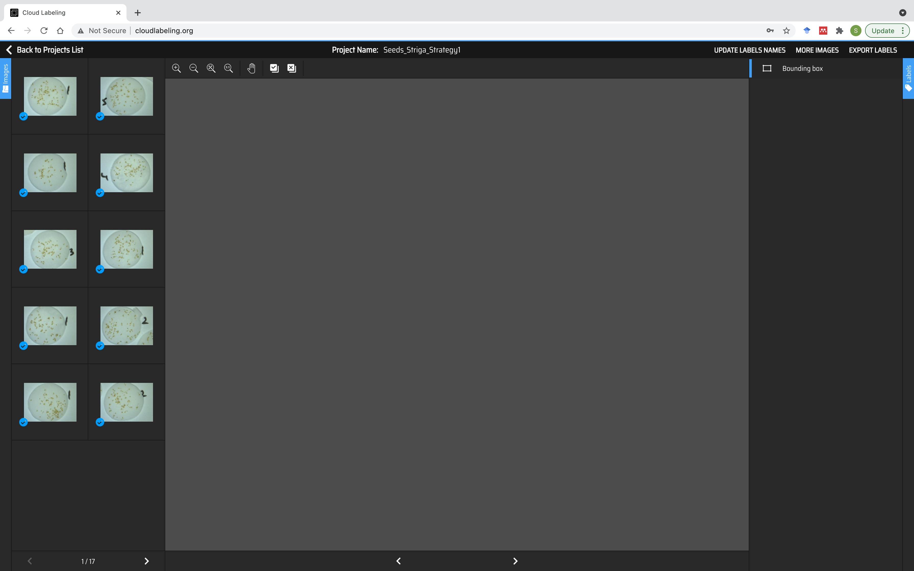

:github_url: https://github.com/SilvioGiancola/CloudLabeling

.. role:: raw-html(raw)
   :format: html
.. default-role:: raw-html

Upload Dataset
=====================

Upload your images by clicking on "More Images".

Either Drag and Drop images, or find them on your computer. 

If you have annotations for your images, you can import them when uploading the images.

We currently support the standard Pascal VOC format (XML).

Your uploaded images will appear on the left panel.

  