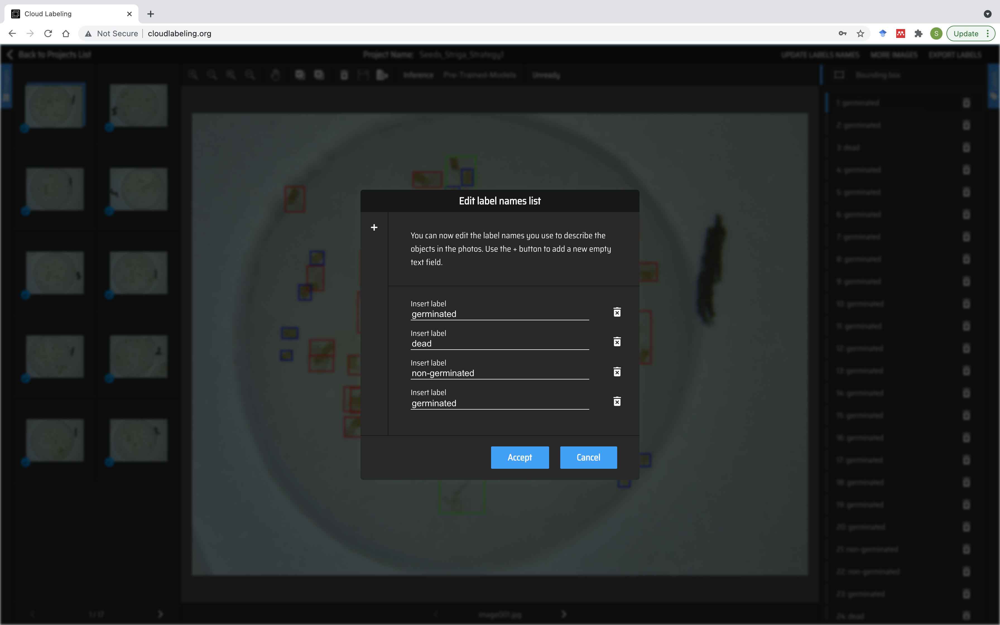

:github_url: https://github.com/SilvioGiancola/CloudLabeling

.. role:: raw-html(raw)
   :format: html
.. default-role:: raw-html

Annotate Images
================

1. Manual Annotation
-----------------

Selct the image you want to annotate on the left panel.

Interact with the image to draw boxes that identifies at best your object.

.. image:: ./image/AnnotateImage.png
  :width: 600
  :alt: Alternative text

Make sure to give your object a class name on the right panel.

You can define the list of object class to detect by clicking on "Update Labels Names".

Once your annotations are complete, make sure to save them by clicking on the red "Save" button.

.. image:: ./image/AnnotationDone.png
  :width: 600
  :alt: Alternative text

2. Automatic annotations
-----------------

You can automatically annotate you images by inference generic pre-trained models.
We provide models pre-trained on:
 - MSCOCO (80 generic classes), 
 - Fish detection (generic), 
 - People detection and
 - Striga Seeds detection (Germinated/Non-Germinated Seeds and Seeds/Radical).

.. image:: ./image/AnnotationFromPreTraining.png
  :width: 600
  :alt: Alternative text

Note that once you have pre-trained your own model, you can also infer your model on those images with the button "Inference".

.. image:: ./image/AnnotationFromCustomModel.png
  :width: 600
  :alt: Alternative text

Note that those automatic annotations will erase your previous manual annotations.

