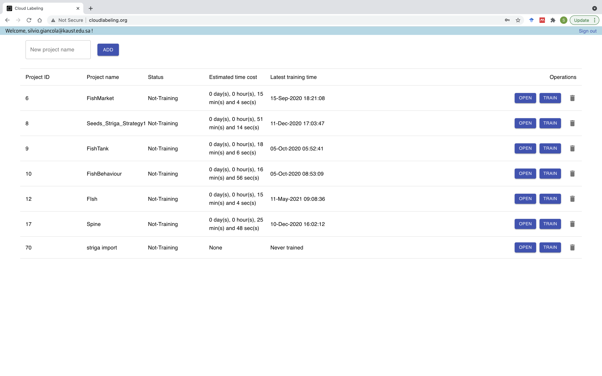

:github_url: https://github.com/SilvioGiancola/CloudLabeling

.. role:: raw-html(raw)
   :format: html
.. default-role:: raw-html

How to Train a Model
================

Once you have annotated at least a couple of images, you can close your project, and start a training on the main landing pages with all your projects.

The interface will inform you whether it is currently training, the estimated time for the training of the model, and when was the last training performed.
