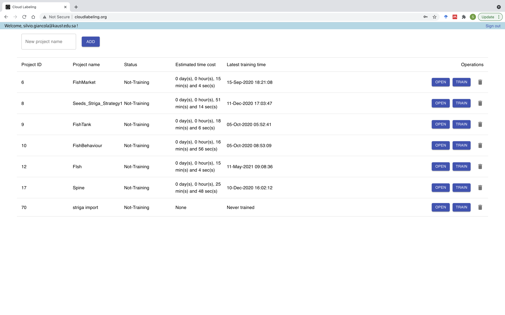

:github_url: https://github.com/SilvioGiancola/CloudLabeling

.. role:: raw-html(raw)
   :format: html
.. default-role:: raw-html

How to Infer with a Model
================

1. Inference on CloudLabeling.org
-----------------

Once you have trained a model, you can infer a 

Once you have trained your own model, you can infer new images you upload in your project with the button "Inference". 

.. image:: ./image/AnnotationFromCustomModel.png
  :width: 600
  :alt: Alternative text

Note that those automatic annotations will erase your previous manual annotations.

2. Remote Inference
-----------------

You can remote infer image by sending your image in our server. 

We provide an API call for remote inference with::

Example for inference::

  curl -H "Content-Type: image/jpeg" \
  -H "project_id: MSCOCO" \
  -X POST \
  --data-binary @/path/to/your/image.jpg \
  http://cloudlabeling.org:4000/api/predict

You can set the *project_id* to any pretrained model available on CloudLabeling, or the model you have trained in your own project, using its unique *project_id* shown in your project list.

We also provide a pip package for python application, available at https://pypi.org/project/cloudlabeling. 

Further information for integration are available on https://github.com/SilvioGiancola/cloudlabeling-api.
